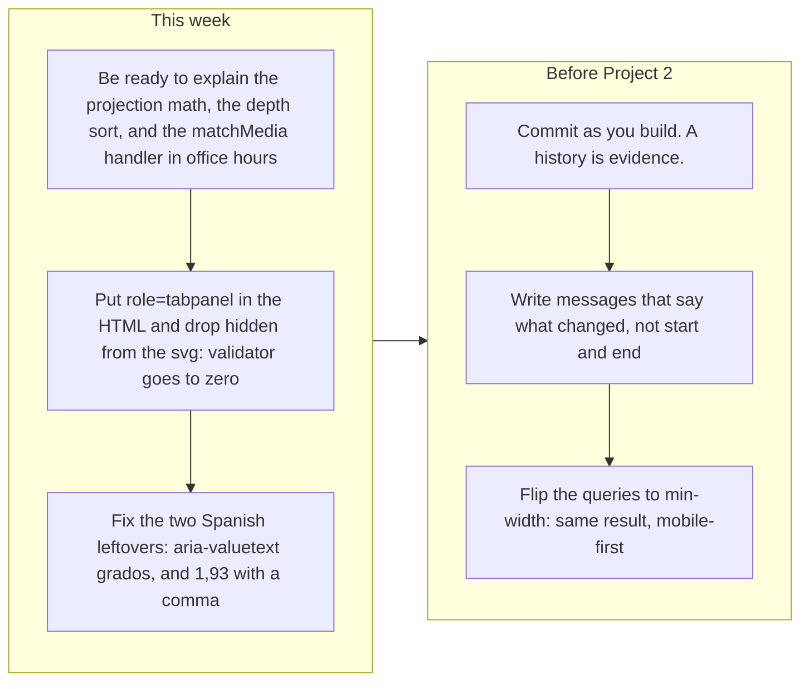

# Project 1: Static Foundations. Feedback for Giovanny Rodríguez

**Student:** Giovanny Rodríguez · **Course:** CSC 436, Fall 2026 · **Reviewed at commit:** [`cba619e`](https://github.com/dreuxx/dreuxx-Static-Foundations/commit/cba619e72bcc842a1a4b87badaae4e7bd2d25d8a)
**Repo:** https://github.com/dreuxx/dreuxx-Static-Foundations · **Live:** https://static-foundations.netlify.app/

> **How this review was made.** Your instructor reviewed this project with Claude (Anthropic's AI) as a second set of eyes. Claude cloned the repo, read every line of the HTML, the 1,075-line stylesheet, the script and the Python build tool, loaded the live site at phone, tablet and desktop widths, ran the W3C validator, worked every control on the page (the menu, the Escape key, the rotation slider, the rotate and highlight and reset buttons, all three tabs), diffed the live site against the repo, and read every commit including the two Spanish-language drafts from Sep 10. Every note and every point below was read and approved by your instructor. Same rubric, same standard, just more time spent looking at your code than one person has in a grading week.

## Grade: 89 / 100

| Category | Points | Earned | One line |
|---|---|---|---|
| Semantic HTML | 20 | **19** | Skip link, labelled sections, figures with captions, a definition list, descriptive alt text, one h1; two validator errors, both about roles the JS adds later |
| CSS layout | 25 | **24** | Ten tokens used 58 times, 20 Flexbox and 6 Grid containers, clamp, focus-visible, reduced-motion, print; desktop-first queries |
| Responsive design | 15 | **15** | No horizontal scroll anywhere, every grid collapses, the menu closes on Escape and manages focus across the breakpoint |
| JavaScript interaction | 15 | **14** | A menu, keyboard-accessible tabs, and a real 3D projection of a real molecule, all verified; one Spanish leftover in an aria attribute |
| Repository and deployment | 15 | **8** | README complete, deploy matches repo byte for byte; the finished site arrived in one 6,590-line commit on the due date, messages say "start" and "end" |
| Content and polish | 10 | **9** | Real structure from the Protein Data Bank, cited sources, illustrations built from the coordinates; a comma decimal in an English page |
| **Total** | **100** | **89** | The best site in the class and the thinnest history. The gap between those two facts is what we need to talk about. |

## The short version

There is nothing else like this in the class. The hero image, the fallback illustration and the interactive model are all derived from the same experimental record, PDB 1EHZ, through a Python script you included in the repo. The model projects 76 points in three dimensions, rotates them, sorts them back to front and redraws an SVG on every slider input. The tabs use a real roving tabindex with arrow keys. The menu closes on Escape and moves focus sensibly when the viewport crosses the breakpoint. There is a skip link, a reduced-motion rule, a print stylesheet, a noscript fallback, and a theme color. The validator finds two errors, both in the "technically" category. No horizontal scroll at any width. The writing is clear and the sources are real.

The points came off in one place, and it is the place the brief warned about. Your Sep 10 commits are a genuine Spanish-language draft of this project: a skeleton, then sections, 445 lines in total. Five days later, at 16:53 on the due date, a commit called "end" adds 6,590 lines: the finished stylesheet, the finished script, the PDB file, nine SVGs, the build tool. Then "AI Translate" turns the Spanish into English, and "netlify" adds the URL. So the history shows a draft, a wall, and a finished site on the other side of it. The brief says the history should show the project developing, and it says the "explain every line" rule applies to everything you submit. That is not a threat; it is the next conversation. The pipeline diagram below is the study guide.

## What the numbers looked like

| Check | Result |
|---|---|
| Horizontal scroll at 375 / 768 / 1280 px | None at any width |
| W3C HTML validator | 2 errors (`hidden` on an svg; tab buttons whose panels get `role="tabpanel"` only from JS), 0 warnings, 20 info notes about trailing slashes |
| Heading order | h1 > h2 > h3, no skipped levels; every section has `aria-labelledby` |
| Semantic elements | skip link, header, nav (ul of 3, aria-label), main, 5 section, 6 article, 6 figure with figcaption, dl, ol, footer |
| Media queries | 6: min-width 1400, max-width 1000 / 760 / 640, prefers-reduced-motion, print |
| Grids at 375 / 1280 | hero 1 / 2, explorer 1 / 2, concepts 1 / 3, type panels 1 / 2, sources 1 / 2 |
| Custom properties | 10 defined in `:root`, used 58 times |
| Mobile menu at 375 | Opens (aria-expanded true, label flips to −), closes on Escape, verified |
| Rotate 30° button | Slider 0 to 30, readout "30°", verified |
| Slider to 90 | Readout "90°", model redrawn, verified |
| Highlight anticodon | aria-pressed false to true, status text changes, reset returns both, verified |
| Tabs | 3 tabs, aria-selected moves, panels hide and show, roving tabindex, verified |
| Console errors | 0 |
| Page weight | 0.65 MB in the repo, most of it the 229 KB PDB download and a 104 KB SVG; no raster images at all |
| Commits | 6: Initial (1 line), start (80), start (365), end (6,590), AI Translate (172), netlify (22) |
| Live vs repo | Identical apart from the badge script Netlify injects |
| README | Title, description, structure, run locally, live URL: all there |

---

## Semantic HTML: 19 / 20

### What's working

- The document is built the way accessibility guides say to build one. A skip link to `main` with `tabindex="-1"` so it can receive focus ([index.html#L18](https://github.com/dreuxx/dreuxx-Static-Foundations/blob/cba619e72bcc842a1a4b87badaae4e7bd2d25d8a/index.html#L18), [#L54](https://github.com/dreuxx/dreuxx-Static-Foundations/blob/cba619e72bcc842a1a4b87badaae4e7bd2d25d8a/index.html#L54)). `<nav aria-label>` with a list. Every `<section>` has `aria-labelledby` pointing at its own heading. The molecule figures use `<figure>` and `<figcaption>`. The specs use a `<dl>`. The sources are an `<ol>`. One `h1`, then `h2` per section, `h3` per card. Every image has alt text that describes what is in the picture, not just what it is ("Atomic model of yeast phenylalanine tRNA, folded into an L shape. Its anticodon appears in orange.").
- The interactive model is an `<svg role="img">` with a `<title>` and a `<desc>` that the script updates as you rotate ([index.html#L141-L154](https://github.com/dreuxx/dreuxx-Static-Foundations/blob/cba619e72bcc842a1a4b87badaae4e7bd2d25d8a/index.html#L141-L154)). The status note has `role="status"` so the highlight announcement is read aloud. The menu button is a real `<button>` with `aria-expanded` and `aria-controls`. There is a `<noscript>` explaining what the static image is.

### What to change

- **Two validator errors, both fixable in the HTML** ([index.html#L146](https://github.com/dreuxx/dreuxx-Static-Foundations/blob/cba619e72bcc842a1a4b87badaae4e7bd2d25d8a/index.html#L146) and [#L364](https://github.com/dreuxx/dreuxx-Static-Foundations/blob/cba619e72bcc842a1a4b87badaae4e7bd2d25d8a/index.html#L364)). `hidden` is not a valid attribute on `<svg>` per the validator; use a class or `style="display:none"` and let the script clear it. And the tab buttons point at panels that only become `role="tabpanel"` after the script runs (script.js line 62), so the static HTML fails the "every tab needs a tabpanel" rule. Put `role="tabpanel"` and `aria-labelledby` on the three articles in the markup and delete lines 61 to 65 of the script. Zero errors, and the tabs are correct even before JavaScript loads.

## CSS layout: 24 / 25

### What's working

- **A real design system in 1,075 lines.** Ten custom properties for color and type ([styles.css#L1-L12](https://github.com/dreuxx/dreuxx-Static-Foundations/blob/cba619e72bcc842a1a4b87badaae4e7bd2d25d8a/css/styles.css#L1-L12)), used 58 times. Twenty Flexbox containers for the nav, the button rows, the legend, the figure headings. Six Grids: the hero, the explorer, the concept cards, the tab panels, the sources. `clamp()` on the display type. `:focus-visible` with a 3px rust outline on everything ([#L59](https://github.com/dreuxx/dreuxx-Static-Foundations/blob/cba619e72bcc842a1a4b87badaae4e7bd2d25d8a/css/styles.css#L59)). A `prefers-reduced-motion` block and a print stylesheet ([#L1036-L1047](https://github.com/dreuxx/dreuxx-Static-Foundations/blob/cba619e72bcc842a1a4b87badaae4e7bd2d25d8a/css/styles.css#L1036-L1047)). The five `!important`s are all legitimate: `[hidden]`, reduced motion, and print.
- The typography is the strongest in the class. Georgia display with a sans body and a mono eyebrow, consistent measure, a reading strip between sections. It looks like a printed notebook, which is the concept.

### What to change

- **Desktop-first.** Four of the six queries are `max-width` ([styles.css#L764](https://github.com/dreuxx/dreuxx-Static-Foundations/blob/cba619e72bcc842a1a4b87badaae4e7bd2d25d8a/css/styles.css#L764), [#L800](https://github.com/dreuxx/dreuxx-Static-Foundations/blob/cba619e72bcc842a1a4b87badaae4e7bd2d25d8a/css/styles.css#L800), [#L873](https://github.com/dreuxx/dreuxx-Static-Foundations/blob/cba619e72bcc842a1a4b87badaae4e7bd2d25d8a/css/styles.css#L873)). The base rules are the 1280 px layout and the queries take columns away. The brief asked for mobile-first, and with grids this clean the flip is mechanical: make the single-column rules the default and add the two- and three-column templates inside `min-width` queries. Same site, right direction.

## Responsive design: 15 / 15

### What's working

- No horizontal scroll at 375, 768 or 1280. Every grid drops to one column on the phone and every one of them does something different on the desktop. The nav wraps under 640 px and the menu button appears only when JavaScript is present (`.has-js .menu-toggle`), so without JS the links are simply visible. The `matchMedia` listener closes the menu and moves focus when the viewport crosses 640 px ([script.js#L36-L43](https://github.com/dreuxx/dreuxx-Static-Foundations/blob/cba619e72bcc842a1a4b87badaae4e7bd2d25d8a/js/script.js#L36-L43)), which is the detail almost nobody handles. Full marks.

## JavaScript interaction: 14 / 15

### What's working

- **Three interactions, each finished.** The menu: `setMenu` writes `aria-expanded`, toggles a class, flips the + to −, closes on a link tap or Escape and returns focus to the button ([script.js#L9-L34](https://github.com/dreuxx/dreuxx-Static-Foundations/blob/cba619e72bcc842a1a4b87badaae4e7bd2d25d8a/js/script.js#L9-L34)). The tabs: `aria-selected`, roving `tabIndex`, ArrowLeft, ArrowRight, Home and End ([#L46-L83](https://github.com/dreuxx/dreuxx-Static-Foundations/blob/cba619e72bcc842a1a4b87badaae4e7bd2d25d8a/js/script.js#L46-L83)). The model: `drawModel` rotates 76 points around the Y axis, projects them, sorts every line and circle by depth so the front of the strand draws over the back, rebuilds the SVG, and updates the readout, the `aria-valuetext` and the `<desc>` ([#L101-L166](https://github.com/dreuxx/dreuxx-Static-Foundations/blob/cba619e72bcc842a1a4b87badaae4e7bd2d25d8a/js/script.js#L101-L166)). Claude clicked and dragged all of it. Zero console errors.
- The model only starts if `rnaPoints` exists and has exactly 76 entries ([#L196-L198](https://github.com/dreuxx/dreuxx-Static-Foundations/blob/cba619e72bcc842a1a4b87badaae4e7bd2d25d8a/js/script.js#L196-L198)); otherwise the static SVG stays. That is a real fallback, not a comment saying there is one.

  ```mermaid
  flowchart TB
    A["assets/data/1EHZ.pdb: 2,825 lines of atomic coordinates from RCSB"] --> B["tools/build_structure.py: keeps one C4 prime carbon per nucleotide"]
    B --> C["assets/data/structure.js: rnaPoints, 76 x y z positions"]
    C --> D["script.js drawModel: rotate around Y, project to 2D, sort back to front"]
    D --> E["SVG #35;model-shapes: 75 lines and 76 circles, redrawn on every slider input"]
    E --> F["Highlight: residues 34 to 36 turn orange, aria-pressed and role=status update"]
  ```

### What to change

- **One word of Spanish survived the translation, and it is the one a screen reader says** ([script.js#L158](https://github.com/dreuxx/dreuxx-Static-Foundations/blob/cba619e72bcc842a1a4b87badaae4e7bd2d25d8a/js/script.js#L158)). `aria-valuetext` is set to `degrees + " grados"`. Every visible string was translated; this one was not, so an English screen-reader user hears "30 grados". Change it to "degrees".
- Small: `drawModel` rebuilds all 151 SVG elements as a string on every `input` event. For 76 points that is fine. If you ever load a bigger structure, keep the elements and update their attributes instead.

## Repository and deployment: 8 / 15

### What's working

- README has everything the brief asks for and more: goal, the requirements list, the live URL, the file structure, how to run it locally ([README.md#L16-L30](https://github.com/dreuxx/dreuxx-Static-Foundations/blob/cba619e72bcc842a1a4b87badaae4e7bd2d25d8a/README.md#L16-L30)). `.gitignore` is sensible. The live site is public and matches the repo exactly. The Python tool and the PDB file are in the repo, which means the illustrations are reproducible; that is more than "real content," it is provenance.

### What to change

- **The history does not show the build** ([commits](https://github.com/dreuxx/dreuxx-Static-Foundations/commits/main)). Two "start" commits on Sep 10 are a real Spanish draft of this project, 445 lines. Then nothing for five days. Then, at 16:53 on Sep 15, a commit called "end" adds 6,590 lines and 17 files: the entire stylesheet, the entire script, the PDB data, every SVG, the build tool. The brief says a single last-minute commit loses repository points and triggers a review of the work. This is that, with a draft in front of it. The draft is what keeps this from being the full penalty.

  ```mermaid
  flowchart LR
    subgraph brief["What the brief asks the history to show"]
      direction TB
      b1["Skeleton"] --> b2["Nav and hero"] --> b3["Each section"] --> b4["Layout and queries"] --> b5["Interaction"] --> b6["Polish and deploy"]
    end
    subgraph yours["What your history shows"]
      direction TB
      y1["Sep 10, 12:13. Initial commit: README, 1 line"] --> y2["Sep 10, 16:39. start: 80 lines, Spanish skeleton"]
      y2 --> y3["Sep 10, 18:26. start: 365 lines, sections in Spanish"]
      y3 --> y4["Sep 15, 16:53. end: 6,590 lines. The whole finished site."]
      y4 --> y5["Sep 15, 17:21. AI Translate: Spanish to English"]
      y5 --> y6["Sep 15, 17:27. netlify: README URL"]
    end
    brief --> yours
  ```

- **The messages say nothing.** "start", "start", "end". A message is for the person reading the history later, including you in a month. "Add tRNA model with rotation and highlight" costs ten seconds and is worth a point.
- The "AI Translate" commit is honest and that honesty is noted. Writing in Spanish and translating is completely fine. The brief's rule is about the code: you must be able to explain every line you submitted. See the next section.

## Content and polish: 9 / 10

### What's working

- The content is real in the strictest sense. The molecule is a specific crystal structure with a citation (Shi and Moore, 2000). The hero art and the fallback drawing are generated from its coordinates. The three concept cards and the three tab panels are accurate and short. The sources section links the PDB entry, the NHGRI glossary and the NCBI Bookshelf. There are no raster images at all, so the page is fast and sharp at every density. The favicon, the theme color and the download link for the original coordinates are the kind of details that make a site feel finished.

### What to change

- **"1,93 Å"** ([index.html#L214](https://github.com/dreuxx/dreuxx-Static-Foundations/blob/cba619e72bcc842a1a4b87badaae4e7bd2d25d8a/index.html#L214)). Comma decimal, from the Spanish original. In English it is 1.93. Small, but it is in the specs table where a reader looks for precision.
- Small: the ids are still Spanish (`#contenido`, `#explorar`, `#conceptos`, `#tipos`, `#fuentes`). Nothing wrong with that, and changing them is optional, but the nav links in the URL bar will read as Spanish to an English visitor.

## On the "explain every line" rule

The brief allows AI and requires that you can explain every line you submit. Nobody is accusing you of anything; the history simply does not show the site being built, and the site is well beyond what the class has seen, so the conversation is the check. Come to office hours ready to walk through these five, in your own words, without notes:

1. **The rotation** ([script.js#L104-L112](https://github.com/dreuxx/dreuxx-Static-Foundations/blob/cba619e72bcc842a1a4b87badaae4e7bd2d25d8a/js/script.js#L104-L112)). Why is `x` computed as `x cos θ + z sin θ` and `z` as `−x sin θ + z cos θ`? What happens to `y`? What is `320 + ... * scale` doing?
2. **The depth sort** ([#L153-L156](https://github.com/dreuxx/dreuxx-Static-Foundations/blob/cba619e72bcc842a1a4b87badaae4e7bd2d25d8a/js/script.js#L153-L156)). Why sort by `depth` ascending before writing the markup? What would you see if you skipped it? Why is a line's depth the average of its two endpoints, and why does a circle get `+ 0.1`?
3. **The breakpoint handler** ([#L36-L43](https://github.com/dreuxx/dreuxx-Static-Foundations/blob/cba619e72bcc842a1a4b87badaae4e7bd2d25d8a/js/script.js#L36-L43)). Walk through what happens to focus when a user has the mobile menu open and rotates a tablet to landscape.
4. **The roving tabindex** ([#L49-L59](https://github.com/dreuxx/dreuxx-Static-Foundations/blob/cba619e72bcc842a1a4b87badaae4e7bd2d25d8a/js/script.js#L49-L59)). Why does only the selected tab get `tabIndex = 0`? What does Tab do versus ArrowRight?
5. **The build tool** ([tools/build_structure.py](https://github.com/dreuxx/dreuxx-Static-Foundations/blob/cba619e72bcc842a1a4b87badaae4e7bd2d25d8a/tools/build_structure.py)). What is a C4′ carbon and why one per nucleotide? How does the script decide which atoms to keep?

If those five come easily, this is a 89 that was earned, and you should be proud of it.

---

## Your next three moves



1. **Prepare the five explanations above.** That is where the remaining question about this project lives, and it is the only thing on this list that is not a code edit.
2. **Zero the validator and fix the two leftovers.** Roles in the markup, no `hidden` on the svg, "degrees", "1.93". Twenty minutes.
3. **For Project 2, commit every time something works.** Ten commits that say what changed are worth more than one perfect one. The site earns the grade; the history keeps it.

*This review lives in a pull request on your repo. It only adds files under `feedback/` and does not touch your code. Merge it, close it, or just read it. Questions go to office hours or the Brightspace board. This is a beautiful piece of work, Giovanny. Come show us how it was made.*
